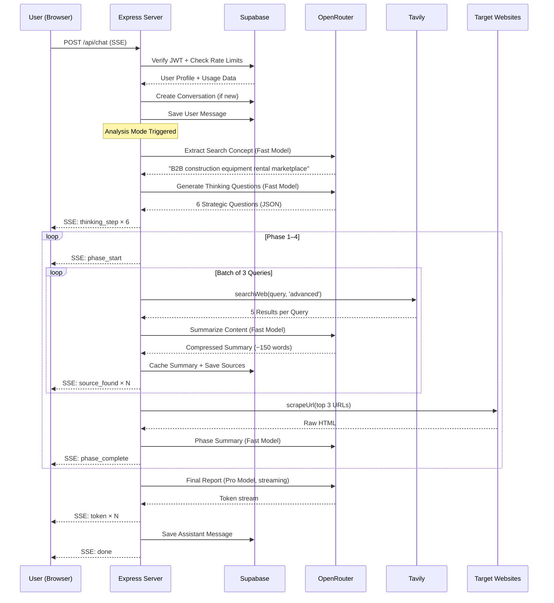
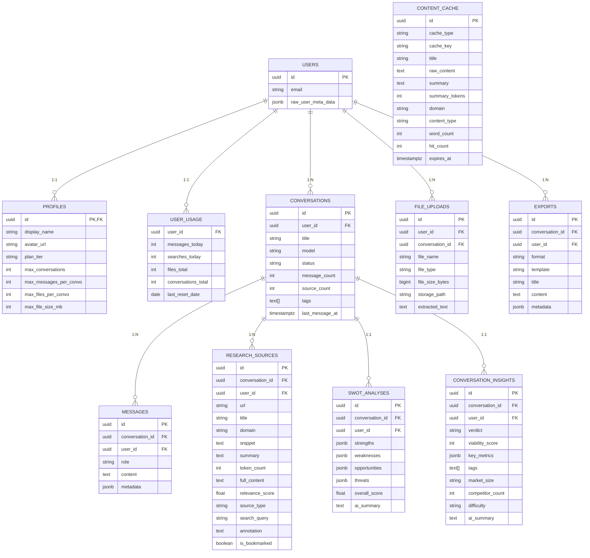

<p align="center">
  
</p>

<h1 align="center">Convix Idea Lab</h1>

<p align="center">
  <strong>AI-Native Startup Validation Engine — Automated Market Intelligence at Scale</strong>
</p>

<p align="center">
  <a href="https://github.com/ThiefRiefMarhas/convix-lab"></a>
  <a href="https://vite.dev/"></a>
  <a href="https://react.dev/"></a>
  <a href="https://www.typescriptlang.org/"></a>
  <a href="https://tailwindcss.com/"></a>
  <a href="https://supabase.com/"></a>
  <a href="https://openrouter.ai/"></a>
  <a href="#"></a>
</p>

<p align="center">
  <a href="#-quickstart">Quickstart</a> •
  <a href="#-system-architecture">Architecture</a> •
  <a href="#-the-4-phase-research-pipeline">Pipeline</a> •
  <a href="#-api-reference">API</a> •
  <a href="#-deployment">Deployment</a> •
  <a href="#-contributing">Contributing</a>
</p>

---

## Table of Contents

- [Vision \& Philosophy](#-vision--philosophy)
- [Quickstart](#-quickstart)
- [System Architecture](#-system-architecture)
- [The 4-Phase Research Pipeline](#-the-4-phase-research-pipeline)
- [Technology Stack](#-technology-stack)
- [Database Schema \& Data Model](#-database-schema--data-model)
- [API Reference](#-api-reference)
- [AI Model Orchestration](#-ai-model-orchestration)
- [Token Budget Management](#-token-budget-management)
- [Content Pipeline \& Caching](#-content-pipeline--caching)
- [Security Architecture](#-security-architecture)
- [Directory Structure](#-directory-structure)
- [Environment Configuration](#-environment-configuration)
- [Deployment](#-deployment)
- [Troubleshooting](#-troubleshooting)
- [Contributing](#-contributing)
- [Roadmap](#-roadmap)
- [Founder \& Contact](#-founder--contact)
- [License](#-license)

---

## 🔭 Vision & Philosophy

**The Problem.** Founders waste months and thousands of dollars validating startup ideas through gut instinct, biased surveys, and shallow Google searches. By the time they discover fatal market flaws, they've already burned runway.

**The Solution.** Convix Idea Lab replaces the traditional 6-week market validation sprint with a fully autonomous AI research department that executes in minutes. It doesn't just _chat_ — it _investigates_. The system deploys a 4-phase research pipeline that crawls live competitor data, mines community sentiment from Reddit and Hacker News, sizes addressable markets with real evidence, and synthesizes everything into an investor-grade validation memo.

**Design Principles:**

| Principle | Implementation |
| :--- | :--- |
| **Evidence over Opinion** | Every claim in the final report is traced back to a specific URL source with AI-generated summaries |
| **Token Efficiency** | Content pipeline summarizes raw web pages into 90% smaller context windows before feeding to LLMs |
| **Graceful Degradation** | `Promise.race` timeouts, cascading model fallbacks, and SSE heartbeats ensure the system never hangs |
| **Zero Configuration AI** | Users describe their idea in natural language — no prompts to engineer, no parameters to tune |
| **Bilingual Native** | Automatic Indonesian/English detection with language-locked responses throughout the entire pipeline |

---

## 🚀 Quickstart

### Prerequisites

- **Node.js** ≥ 20.0.0
- **npm** ≥ 9.0.0
- **Supabase** project with database access
- **OpenRouter** API key with credits
- **Tavily** API key for web search

### Installation

```bash
# 1. Clone the repository
git clone https://github.com/ThiefRiefMarhas/convix-lab.git
cd convix-lab

# 2. Install dependencies
npm install

# 3. Configure environment
cp .env.example .env
# Edit .env with your API keys (see Environment Configuration section)

# 4. Run database migrations
# Execute each SQL file in order in your Supabase SQL Editor:
#   supabase/migration_001_core_schema.sql
#   supabase/migration_002_vector_cache.sql
#   supabase/migration_003_feature_expansion.sql
#   supabase/migration_004_rate_limit_fix.sql
#   supabase/migration_005_conversations_trigger.sql

# 5. Start development server
npm run dev
```

The application will be available at `http://localhost:3000`. Both the Vite HMR frontend and Express API server run concurrently from a single process.

### Available Scripts

| Script | Command | Description |
| :--- | :--- | :--- |
| **Development** | `npm run dev` | Start dev server with Vite HMR + Express API |
| **Build** | `npm run build` | Compile frontend (Vite) + backend (esbuild) to `dist/` |
| **Production** | `npm start` | Run compiled production server from `dist/server.cjs` |
| **Type Check** | `npm run lint` | Run TypeScript compiler with `--noEmit` for type validation |
| **Clean** | `npm run clean` | Remove `dist/` and compiled artifacts |

---

## 🏗 System Architecture

Convix is a monolithic full-stack TypeScript application with a clear separation between the Express API server and the React SPA frontend, unified by a single Node.js process.

```
┌──────────────────────────────────────────────────────────────────┐
│                        CLIENT (Browser)                          │
│  ┌─────────────────────────────────────────────────────────┐     │
│  │  React 19 SPA                                           │     │
│  │  ├── Dashboard (Chat + Research Canvas + SWOT Panel)    │     │
│  │  ├── Landing Pages (Home, About, Features, Pricing)     │     │
│  │  ├── Auth (Supabase Auth UI + Protected Routes)         │     │
│  │  └── State: useChat() + useConversations() hooks        │     │
│  └────────────────────────┬────────────────────────────────┘     │
│                           │ SSE Stream / REST                    │
└───────────────────────────┼──────────────────────────────────────┘
                            │
┌───────────────────────────┼──────────────────────────────────────┐
│                    EXPRESS API SERVER                             │
│  ┌────────────────────────┼────────────────────────────────┐     │
│  │              Middleware Chain                             │     │
│  │  ├── express.json({ limit: '10mb' })                    │     │
│  │  ├── requireAuth (JWT verification via Supabase)         │     │
│  │  └── rateLimiter (per-user daily limits)                 │     │
│  └────────────────────────┼────────────────────────────────┘     │
│                           │                                      │
│  ┌────────────────────────┼────────────────────────────────┐     │
│  │              9 API Route Modules                         │     │
│  │  ├── /api/chat          → SSE streaming + tool calls    │     │
│  │  ├── /api/conversations → CRUD operations               │     │
│  │  ├── /api/upload        → File upload + PDF extraction  │     │
│  │  ├── /api/transcribe    → Audio transcription           │     │
│  │  ├── /api/export        → Report export (MD/JSON)       │     │
│  │  ├── /api/swot          → SWOT analysis CRUD            │     │
│  │  ├── /api/sources       → Research source management    │     │
│  │  ├── /api/analytics     → Usage analytics               │     │
│  │  └── /api/insights      → Conversation insights         │     │
│  └────────────────────────┼────────────────────────────────┘     │
│                           │                                      │
│  ┌────────────────────────┼────────────────────────────────┐     │
│  │              Core Services Layer                         │     │
│  │  ├── openrouter.ts      → Multi-model LLM gateway      │     │
│  │  ├── analysis-pipeline  → 4-phase orchestrator          │     │
│  │  ├── content-pipeline   → Summarize + cache + tokenize  │     │
│  │  ├── context-builder    → Token budget allocator        │     │
│  │  ├── tavily.ts          → Web search API client         │     │
│  │  ├── scraper.ts         → Cheerio HTML extraction       │     │
│  │  └── supabase-admin.ts  → Database + auth operations    │     │
│  └────────────────────────┼────────────────────────────────┘     │
│                           │                                      │
└───────────────────────────┼──────────────────────────────────────┘
                            │
┌───────────────────────────┼──────────────────────────────────────┐
│                    EXTERNAL SERVICES                             │
│  ├── Supabase (PostgreSQL + Auth + Storage + RLS)               │
│  ├── OpenRouter (Claude Opus 4.6 / Gemini 3.1 Pro / Flash 2.5) │
│  └── Tavily (Advanced web search with answer extraction)        │
└──────────────────────────────────────────────────────────────────┘
```

### Request Lifecycle (Chat with Analysis)



---

## 🔬 The 4-Phase Research Pipeline

The analysis pipeline is the core differentiator of Convix. It replaces a human research team's multi-week workflow with an autonomous, parallelized investigation engine.

### Phase Architecture


### Phase Detail Specification

| Phase | Name | Queries | Typical Sources | Search Strategy | Output |
| :---: | :--- | :---: | :---: | :--- | :--- |
| **1** | Competitive Landscape | 8 | ~40 | `{idea} competitors startups`, `{idea} alternatives`, `{idea} market leaders`, `{idea} funding raised` | Competitor table with funding, features, weaknesses |
| **2** | Market Vulnerability | 8 | ~40 | `{idea} problems complaints`, `{idea} unmet needs`, `{idea} market size TAM`, `{idea} pricing comparison` | Gap analysis with revenue potential estimates |
| **3** | Community Signals | 8 | ~30 | `site:reddit.com {idea}`, `site:news.ycombinator.com`, `site:producthunt.com`, `site:indiehackers.com` | Real user frustrations, demand signals, quotes |
| **4** | Strategic Synthesis | 6 | ~20 | `{idea} business model revenue`, `{idea} go to market strategy`, `{idea} VC investment thesis` | TAM/SAM/SOM, timing assessment, recommended niche |

### Final Report Structure

The AI synthesizes all phase data into a structured investment memo:

```
[VERDICT:GREEN/YELLOW/RED] — Confidence Score (0-100%)

📊 Executive Verdict
   → One powerful paragraph with specific dollar amounts, competitor names

🏢 Competitive Landscape
   → Table: Name | Founded | Funding | Key Features | Weakness

🔍 Market Gap Analysis
   → Specific gaps with evidence, revenue potential per gap

💬 Community Demand Signals
   → Real quotes from Reddit/HN/ProductHunt, thematic analysis

📈 Market Sizing
   → TAM / SAM / SOM with methodology and growth rate

⚡ Strategic Verdict
   → Opportunity Score, Revenue Potential (Y1), Timing, Difficulty, Niche

🎯 Next Steps (This Week)
   → 3-5 hyper-specific actionable items
```

---

## 🛠 Technology Stack

### Complete Dependency Matrix

| Layer | Technology | Version | Purpose |
| :--- | :--- | :---: | :--- |
| **Runtime** | Node.js | ≥ 20 | Server-side JavaScript execution |
| **Language** | TypeScript | 5.8 | Type-safe development across full stack |
| **Frontend Framework** | React | 19.0.1 | Component-based UI with concurrent features |
| **Build Tool** | Vite | 6.2.3 | Sub-second HMR, optimized production bundles |
| **Backend Bundler** | esbuild | 0.25.0 | Compiles server TypeScript to CJS for production |
| **Dev Runtime** | tsx | 4.21.0 | TypeScript execution without compilation step |
| **CSS Framework** | Tailwind CSS | 4.1.14 | Utility-first styling with HSL custom properties |
| **Animation** | Motion (Framer) | 12.23.24 | Hardware-accelerated layout animations |
| **Icons** | Lucide React | 0.546.0 | Consistent, tree-shakeable SVG icon system |
| **Smooth Scroll** | Lenis | 1.3.23 | 60fps inertia scrolling with `data-lenis-prevent` |
| **API Server** | Express | 4.21.2 | Route handling, middleware pipeline, SSE streaming |
| **Database** | Supabase (PostgreSQL) | 2.105.4 | Relational storage, Row Level Security, Auth, Storage |
| **LLM Gateway** | OpenRouter SDK | — | Multi-model routing with automatic fallback chains |
| **Web Search** | Tavily | 0.7.3 | Advanced search with answer extraction (5 results/query) |
| **HTML Parsing** | Cheerio | 1.2.0 | Server-side DOM traversal for web scraping |
| **HTTP Client** | Axios | 1.16.1 | HTTP requests for web scraping with timeout control |
| **File Upload** | Multer | 2.1.1 | Multipart form handling for PDF/document uploads |
| **PDF Parsing** | pdf-parse | 2.4.5 | Extract text content from uploaded PDF documents |
| **Routing** | React Router | 7.15.1 | Client-side navigation with protected route guards |
| **Utility** | clsx + tailwind-merge | — | Conditional class composition without conflicts |
| **Confetti** | canvas-confetti | 1.9.4 | Celebration animations on analysis completion |
| **WebSocket** | ws | 8.20.1 | Reserved for future real-time collaboration features |
| **Env Config** | dotenv | 17.2.3 | Environment variable management |

### Frontend Component Census

| Category | Count | Key Components |
| :--- | :---: | :--- |
| Pages | 8 | Dashboard, Home, About, Features, Pricing, Contact, Privacy, Terms |
| Chat Components | 8 | ChatPanel, ChatInput, MessageBubble, ResearchCanvas, SourceCard, ThinkingPhase, PhaseIndicator, ToolCallCard |
| Auth Components | 2 | AuthModal, ProtectedRoute |
| Landing Components | 4 | CinematicHero, DashboardPreview, IdeaValidator, InsightsHub |
| Layout Components | 3 | LandingLayout, Navbar, Footer |
| Custom Hooks | 2 | useChat, useConversations |
| Context Providers | 3 | AuthContext, ThemeContext, LocaleContext |
| **Total Frontend Files** | **50** | TypeScript + TSX across `src/` |

### Backend Service Census

| Category | Count | Key Modules |
| :--- | :---: | :--- |
| API Routes | 9 | chat, conversations, upload, transcribe, export, swot, sources, analytics, insights |
| Core Services | 6 | openrouter, analysis-pipeline, content-pipeline, context-builder, tavily, scraper |
| Middleware | 2 | auth, rate-limiter |
| Prompt Definitions | 1 | system.ts (Brainstorm + Analysis personas) |
| **Total Backend Files** | **20** | TypeScript across `server/` |

---

## 🗃 Database Schema & Data Model

The database is PostgreSQL hosted on Supabase, with Row Level Security (RLS) enforced on every table. Schema is managed through 5 sequential migration files.

### Entity Relationship Diagram



### Migration History

| Migration | File | Description |
| :---: | :--- | :--- |
| **001** | `migration_001_core_schema.sql` | Profiles, Conversations, Messages, Research Sources, File Uploads, User Usage, Storage bucket, auto-increment triggers |
| **002** | `migration_002_vector_cache.sql` | Content cache table with TTL expiry, unique composite index on `(cache_type, cache_key)` |
| **003** | `migration_003_feature_expansion.sql` | Exports, SWOT Analyses, Conversation Insights, source annotations, conversation tags |
| **004** | `migration_004_rate_limit_fix.sql` | Rate limiting column adjustments and `analyses_today` counter |
| **005** | `migration_005_conversations_trigger.sql` | Auto-update `updated_at` trigger on conversation modifications |

### Row Level Security Model

Every table enforces RLS with the pattern:

```sql
-- SELECT: Users can only read their own data
USING ((SELECT auth.uid()) = user_id)

-- INSERT: Users can only insert for themselves
WITH CHECK ((SELECT auth.uid()) = user_id)

-- UPDATE/DELETE: Same ownership check
USING ((SELECT auth.uid()) = user_id)
```

The `service_role` key (server-side only) bypasses RLS for administrative operations like usage tracking and cross-user analytics.

---

## 📡 API Reference

All endpoints require authentication via `Authorization: Bearer <supabase_jwt>` header unless noted otherwise.

### Core Endpoints

#### `POST /api/chat` — Streaming Analysis & Chat

The primary endpoint. Returns a **Server-Sent Events** stream.

**Request Body:**
```json
{
  "conversationId": "uuid | null",
  "message": "A marketplace for local Indonesian artisan furniture",
  "model": "Convix Fast",
  "webSearchEnabled": false,
  "attachmentIds": [],
  "analysisMode": false,
  "locale": "en",
  "indonesiaFocus": false
}
```

**SSE Event Types:**

| Event | Payload | Description |
| :--- | :--- | :--- |
| `conversation_created` | `{ conversationId }` | New conversation was created |
| `thinking_step` | `{ question }` | AI is formulating strategic research questions |
| `thinking_complete` | `{}` | Pre-research thinking phase finished |
| `phase_start` | `{ phase, phaseName, totalPhases }` | Research phase N has begun |
| `phase_progress` | `{ phase, status, sourcesFound, completedQueries }` | Phase progress update |
| `source_found` | `{ phase, url, title, domain, snippet, fromCache }` | Individual source discovered |
| `phase_complete` | `{ phase, phaseName, sourcesFound, summary }` | Phase N finished with summary |
| `analysis_complete` | `{ totalSources, phases[] }` | All 4 phases completed |
| `token` | `{ content }` | Streaming text token from LLM |
| `tool_start` | `{ tool, query?, url? }` | AI initiated a tool call |
| `tool_result` | `{ tool, sources?, url?, error? }` | Tool call returned results |
| `title_generated` | `{ conversationId, title }` | Auto-generated conversation title |
| `done` | `{ conversationId, toolTokensUsed? }` | Stream complete |
| `error` | `{ message }` | Error occurred |

---

#### `GET /api/conversations` — List Conversations

Returns all conversations for the authenticated user, ordered by most recent.

**Response:**
```json
[
  {
    "id": "uuid",
    "title": "Indonesian Furniture Marketplace",
    "model": "Convix Fast",
    "status": "active",
    "message_count": 7,
    "source_count": 134,
    "created_at": "2026-05-20T10:00:00Z",
    "last_message_at": "2026-05-20T10:15:00Z"
  }
]
```

---

#### `POST /api/upload` — File Upload

Accepts multipart form data. Supports PDF, TXT, and document files up to 10MB.

**Response:**
```json
{
  "id": "uuid",
  "fileName": "pitch_deck.pdf",
  "fileType": "application/pdf",
  "extractedText": "Full extracted text content..."
}
```

---

#### `GET /api/swot/:conversationId` — SWOT Analysis

Returns the SWOT analysis for a conversation.

**Response:**
```json
{
  "strengths": [{ "text": "First mover in segment", "score": 8, "evidence": "..." }],
  "weaknesses": [{ "text": "High logistics cost", "score": 6, "evidence": "..." }],
  "opportunities": [{ "text": "Growing middle class", "score": 9, "evidence": "..." }],
  "threats": [{ "text": "Established e-commerce players", "score": 5, "evidence": "..." }],
  "overall_score": 75,
  "ai_summary": "Overall execution summary."
}
```

---

#### `GET /api/insights/:conversationId` — Conversation Insights

Returns AI-generated insights and verdict for a conversation.

---

#### `GET /api/sources/:conversationId` — Research Sources

Returns all discovered research sources for a conversation.

---

#### `POST /api/export` — Export Report

Generates an exportable report from conversation data.

| Format | Description |
| :--- | :--- |
| `markdown` | Structured markdown document with headings, tables, and citations |
| `json` | Machine-readable structured data object |

---

#### `GET /api/analytics` — Usage Analytics

Returns the authenticated user's usage statistics (messages, searches, conversations).

---

## 🤖 AI Model Orchestration

Convix uses **OpenRouter** as a unified gateway to access multiple frontier LLM providers with automatic fallback chains.

### Model Tiers

| Tier | Primary Model | Fallback Model | Temperature | Max Tokens | Use Case |
| :--- | :--- | :--- | :---: | :---: | :--- |
| **Convix Pro** | Claude Opus 4.6 | Gemini 3.1 Pro Preview | 0.7 | 8,192 | Final analysis reports, complex synthesis |
| **Convix Fast** | Gemini 2.5 Flash | Claude Haiku 4.5 | 0.5 | 4,096 | Brainstorm chat, summarization, concept extraction |
| **Convix Creative** | Gemini 2.5 Pro | Claude Sonnet 4.6 | 0.8 | 4,096 | Creative ideation, alternative perspectives |

### Fallback Mechanism

```typescript
// OpenRouter's `models` array provides automatic failover
{
  models: ['anthropic/claude-opus-4.6', 'google/gemini-3.1-pro-preview'],
  // If Claude Opus is unavailable or rate-limited,
  // OpenRouter automatically routes to Gemini 3.1 Pro
}
```

### Tool Definitions

The LLM has access to two tools during brainstorm mode:

| Tool | Function | Description |
| :--- | :--- | :--- |
| `tavily_search` | `searchWeb(query, type)` | Search the web for real-time market data, competitors, and trends |
| `scrape_website` | `scrapeUrl(url)` | Extract and summarize content from a specific website URL |

Tools are dynamically enabled/disabled based on remaining token budget (`canAddTools` check in context builder).

### Dual Persona System

The AI operates under two distinct personas:

**Brainstorm Mode** — Friendly, concise co-founder:
- 1-3 sentence responses
- Asks ONE question at a time
- Natural conversational tone
- No bullet lists or formal structure
- Auto-triggers analysis after 3+ user messages

**Analysis Mode** — Senior VC Strategic Analyst:
- Opens with bold verdict (GREEN/YELLOW/RED)
- Bloomberg/TechCrunch editorial quality
- Specific numbers, company names, dollar amounts
- Investor-ready structured report format

---

## 📐 Token Budget Management

The context builder implements a strict token budget system to prevent context window overflow during multi-tool conversations.

### Budget Allocation (per turn)

```
Total Budget: 30,000 tokens
├── System Prompt:          1,000 tokens (fixed)
├── Conversation History:   8,000 tokens (recent messages, first + last N)
├── File Context:           3,000 tokens (attached PDFs, truncated)
├── Tool Results:           6,000 tokens (search + scrape summaries)
└── Response Reserve:      12,000 tokens (AI output space)
```

### History Trimming Strategy

```
Strategy: Keep FIRST message (original idea) + LAST N messages (recent context)

[Message 1: Original Idea]  ← Always preserved
[Message 2: ...]            ← Trimmed if over budget
[Message 3: ...]            ← Trimmed if over budget
...
[Message N-2]               ← Kept (recent)
[Message N-1]               ← Kept (recent)
[Message N: Latest]         ← Always kept
```

### Dynamic Tool Gating

```typescript
// Tools are disabled when budget is exhausted
const budget = getRemainingBudget({...});
const stream = createStreamingCompletion(msgs, model, budget.canAddTools);
// canAddTools = false when toolBudget < 500 tokens
```

---

## 🔄 Content Pipeline & Caching

The content pipeline is the system's "efficiency engine" — it reduces LLM token consumption by 80-90% through intelligent summarization and caching.

### Pipeline Flow

```
Raw Web Content (5,000 chars)
    │
    ├── Check Cache (content_cache table)
    │     ├── HIT → Return cached summary (0 API calls) → Increment hit_count
    │     └── MISS ↓
    │
    ├── Summarize via LLM (Convix Fast, max 400 tokens)
    │     ├── Webpage → "Summarize for startup market research" (max 150 words)
    │     └── Search Results → "Market intelligence brief" (max 200 words)
    │
    ├── Cache Result (7-day TTL, upsert on cache_type + cache_key)
    │
    └── Return Summary (~500 chars)
         └── Token savings: ~90% (5,000 → 500 chars)
```

### Cache Statistics

| Metric | Value |
| :--- | :--- |
| Cache TTL | 7 days |
| Max raw content stored | 50,000 characters |
| Hit count tracking | Per-entry, auto-incrementing |
| Deduplication key | `(cache_type, cache_key)` composite unique |

---

## 🔒 Security Architecture

### Authentication Flow

```
Browser → Supabase Auth (Google/GitHub/Email) → JWT
    │
    └── Express Middleware: requireAuth
          │
          ├── Extract: Authorization: Bearer <jwt>
          ├── Verify: supabaseAdmin.auth.getUser(token)
          ├── Attach: req.user = { userId, email }
          └── Next() or 401
```

### Rate Limiting

| Limit | Scope | Enforcement |
| :--- | :--- | :--- |
| Messages per day | Per user | Middleware check against `user_usage.messages_today` |
| Searches per day | Per user | Incremented per Tavily API call |
| Analyses per day | Per user | Checked before pipeline execution |
| Conversations total | Per user | Hard cap from `profiles.max_conversations` |
| File size | Per upload | 10MB limit via Multer + Supabase Storage |
| Request body | Global | 10MB JSON limit via Express |

### Network Resilience

| Mechanism | Implementation | Purpose |
| :--- | :--- | :--- |
| SSE Heartbeat | `: keep-alive\n\n` every 15 seconds | Prevent NAT/proxy/mobile carrier timeout drops |
| TCP Keep-Alive | `req.socket.setKeepAlive(true, 1000)` | Prevent OS-level socket recycling |
| Socket Timeout | `req.socket.setTimeout(0)` | Disable default Node.js socket timeout |
| Search Timeout | `Promise.race` with 25-second fallback | Prevent hung search queries from blocking pipeline |
| Scrape Timeout | `Promise.race` with 10-second fallback | Prevent slow websites from stalling analysis |
| LLM Timeout | `AbortController` with 180-second signal | Prevent hung LLM requests during long reports |
| Flush Headers | `res.flushHeaders()` + manual `flush()` | Ensure SSE bytes are sent immediately (no buffering) |
| Content Encoding | `Content-Encoding: identity` | Disable compression that could buffer SSE chunks |

---

## 📁 Directory Structure

```
convix-idea-lab/
├── public/                          # Static assets served at root
│   ├── manifest.json                # PWA manifest
│   ├── robots.txt                   # Search engine crawling rules
│   └── sitemap.xml                  # XML sitemap for SEO
│
├── src/                             # Frontend source (50 files)
│   ├── components/
│   │   ├── auth/
│   │   │   ├── AuthModal.tsx        # Supabase Auth UI modal
│   │   │   └── ProtectedRoute.tsx   # Route guard with redirect
│   │   ├── chat/
│   │   │   ├── ChatInput.tsx        # Message input with file attach
│   │   │   ├── ChatPanel.tsx        # Message list + streaming view
│   │   │   ├── MessageBubble.tsx    # Individual message renderer
│   │   │   ├── PhaseIndicator.tsx   # Analysis phase progress bars
│   │   │   ├── ResearchCanvas.tsx   # Interactive SVG source graph
│   │   │   ├── SourceCard.tsx       # Research source display card
│   │   │   ├── ThinkingPhase.tsx    # AI thinking animation
│   │   │   └── ToolCallCard.tsx     # Tool execution indicator
│   │   ├── landing/
│   │   │   ├── CinematicHero.tsx    # Full-screen hero with animation
│   │   │   ├── DashboardPreview.tsx # Interactive dashboard mockup
│   │   │   ├── IdeaValidator.tsx    # Quick validation CTA widget
│   │   │   └── InsightsHub.tsx      # Feature showcase cards
│   │   ├── Footer.tsx               # Global footer with links
│   │   ├── Gauge.tsx                # Animated viability score gauge
│   │   ├── Navbar.tsx               # Responsive navigation bar
│   │   └── VideoEmbed.tsx           # YouTube embed component
│   │
│   ├── context/
│   │   ├── AuthContext.tsx           # Supabase session management
│   │   ├── LocaleContext.tsx         # ID/EN language state
│   │   └── ThemeContext.tsx          # Light/Dark theme toggle
│   │
│   ├── hooks/
│   │   ├── useChat.ts               # SSE stream handler, tool state
│   │   └── useConversations.ts      # Conversation CRUD operations
│   │
│   ├── i18n/
│   │   └── ui.ts                    # Bilingual string definitions
│   │
│   ├── layouts/
│   │   └── LandingLayout.tsx        # Navbar + Footer wrapper
│   │
│   ├── lib/
│   │   ├── supabase.ts              # Supabase client initialization
│   │   └── user-errors.ts           # Error formatting utilities
│   │
│   ├── pages/
│   │   ├── About.tsx                # Company information
│   │   ├── Contact.tsx              # Contact form + resources
│   │   ├── Dashboard.tsx            # Main application (51KB)
│   │   ├── Features.tsx             # Feature showcase
│   │   ├── Home.tsx                 # Landing page
│   │   ├── Pricing.tsx              # Subscription tiers
│   │   ├── Privacy.tsx              # Privacy policy
│   │   ├── SubscriptionSuccess.tsx  # Post-payment confirmation
│   │   └── Terms.tsx                # Terms of service
│   │
│   ├── services/
│   │   └── api.ts                   # Typed API client layer
│   │
│   ├── styles/
│   │   └── fonts.css                # Custom font declarations
│   │
│   ├── App.tsx                      # Root component with providers
│   ├── AppRoutes.tsx                # React Router configuration
│   ├── index.css                    # Global styles + CSS variables
│   ├── main.tsx                     # DOM mount + Lenis init
│   └── vite-env.d.ts                # Vite type declarations
│
├── server/                          # Backend source (20 files)
│   ├── middleware/
│   │   ├── auth.ts                  # JWT verification middleware
│   │   └── rate-limiter.ts          # Per-user rate limiting
│   │
│   ├── routes/
│   │   ├── analytics.ts             # GET /api/analytics
│   │   ├── chat.ts                  # POST /api/chat (SSE stream)
│   │   ├── conversations.ts         # CRUD /api/conversations
│   │   ├── export.ts                # POST /api/export
│   │   ├── insights.ts              # GET /api/insights/:id
│   │   ├── sources.ts               # GET /api/sources/:id
│   │   ├── swot.ts                  # CRUD /api/swot/:id
│   │   ├── transcribe.ts            # POST /api/transcribe
│   │   └── upload.ts                # POST /api/upload
│   │
│   ├── services/
│   │   ├── analysis-pipeline.ts     # 4-phase research orchestrator
│   │   ├── content-pipeline.ts      # Summarize + cache + tokenize
│   │   ├── context-builder.ts       # Token budget allocation
│   │   ├── openrouter.ts            # Multi-model LLM gateway
│   │   ├── scraper.ts               # Cheerio HTML extractor
│   │   ├── supabase-admin.ts        # DB + auth admin operations
│   │   └── tavily.ts                # Web search API client
│   │
│   └── prompts/
│       └── system.ts                # Brainstorm + Analysis personas
│
├── supabase/                        # Database migrations
│   ├── migration_001_core_schema.sql
│   ├── migration_002_vector_cache.sql
│   ├── migration_003_feature_expansion.sql
│   ├── migration_004_rate_limit_fix.sql
│   └── migration_005_conversations_trigger.sql
│
├── server.ts                        # Express server entry point
├── Dockerfile                       # Multi-stage Alpine build
├── package.json                     # Dependencies + scripts
├── tsconfig.json                    # TypeScript configuration
├── vite.config.ts                   # Vite build configuration
└── README.md                        # ← You are here
```

---

## ⚙ Environment Configuration

Create a `.env` file in the project root:

```env
# ┌────────────────────────────────────────────────────┐
# │           SUPABASE CONFIGURATION                   │
# └────────────────────────────────────────────────────┘
# Project URL from Supabase Dashboard → Settings → API
VITE_SUPABASE_URL=https://your-project.supabase.co
# Anon (public) key — safe for client-side use
VITE_SUPABASE_ANON_KEY=eyJ...your_anon_key
# Service role key — server-side only, bypasses RLS
SUPABASE_SERVICE_ROLE_KEY=eyJ...your_service_role_key

# ┌────────────────────────────────────────────────────┐
# │           AI MODEL CONFIGURATION                   │
# └────────────────────────────────────────────────────┘
# OpenRouter API key from https://openrouter.ai/keys
OPENROUTER_API_KEY=sk-or-v1-your_key_here
# Base URL (default: https://openrouter.ai/api/v1)
OPENROUTER_BASE_URL=https://openrouter.ai/api/v1

# ┌────────────────────────────────────────────────────┐
# │           WEB SEARCH CONFIGURATION                 │
# └────────────────────────────────────────────────────┘
# Tavily API key from https://tavily.com
TAVILY_API_KEY=tvly-your_key_here

# ┌────────────────────────────────────────────────────┐
# │           SERVER CONFIGURATION                     │
# └────────────────────────────────────────────────────┘
# Express server port (default: 3000, production: 8080)
PORT=3000
# Node environment (development | production)
NODE_ENV=development
```

### API Key Acquisition Guide

| Service | URL | Free Tier | Required |
| :--- | :--- | :--- | :---: |
| **Supabase** | [supabase.com/dashboard](https://supabase.com/dashboard) | 500MB DB, 50K auth users | ✅ |
| **OpenRouter** | [openrouter.ai/keys](https://openrouter.ai/keys) | Pay-per-token, no minimum | ✅ |
| **Tavily** | [tavily.com](https://tavily.com) | 1,000 searches/month | ✅ |

---

## 🚢 Deployment

### Docker (Recommended)

The application uses a multi-stage Alpine build for minimal image size:

```dockerfile
# Stage 1: Build (node:20-alpine)
# - Install dependencies (npm ci)
# - Build frontend (vite build)
# - Bundle backend (esbuild → dist/server.cjs)

# Stage 2: Production (node:20-alpine)
# - Copy dist/, package*.json, node_modules
# - Set NODE_ENV=production, PORT=8080
# - CMD: node dist/server.cjs
```

**Build and run locally:**

```bash
# Build the container
docker build -t convix-lab .

# Run with environment variables
docker run -p 8080:8080 --env-file .env convix-lab

# Verify at http://localhost:8080
```

### Google Cloud Run

```bash
# 1. Build and push to Container Registry
gcloud builds submit --tag gcr.io/YOUR_PROJECT_ID/convix-lab

# 2. Deploy to Cloud Run
gcloud run deploy convix-lab \
  --image gcr.io/YOUR_PROJECT_ID/convix-lab \
  --platform managed \
  --port 8080 \
  --memory 512Mi \
  --cpu 1 \
  --min-instances 0 \
  --max-instances 10 \
  --set-env-vars "NODE_ENV=production"

# 3. Set secrets (run once)
gcloud run services update convix-lab \
  --set-env-vars "VITE_SUPABASE_URL=https://..." \
  --set-env-vars "VITE_SUPABASE_ANON_KEY=eyJ..." \
  --set-env-vars "SUPABASE_SERVICE_ROLE_KEY=eyJ..." \
  --set-env-vars "OPENROUTER_API_KEY=sk-or-..." \
  --set-env-vars "TAVILY_API_KEY=tvly-..."
```

### Production Environment Variables

In production, the server injects Supabase credentials into `index.html` at serve time via string replacement:

```typescript
// server.ts — Production static serving
const injected = html
  .replace('__VITE_SUPABASE_URL__', process.env.VITE_SUPABASE_URL || '')
  .replace('__VITE_SUPABASE_ANON_KEY__', process.env.VITE_SUPABASE_ANON_KEY || '');
```

This allows environment-specific configuration without rebuilding the frontend.

---

## 🔧 Troubleshooting

### Common Issues

<details>
<summary><strong>❌ "OpenRouter API key not configured"</strong></summary>

**Cause:** Missing or invalid `OPENROUTER_API_KEY` in `.env`.

**Fix:**
1. Verify your key at [openrouter.ai/keys](https://openrouter.ai/keys)
2. Ensure `.env` has `OPENROUTER_API_KEY=sk-or-v1-...` (no quotes)
3. Restart the dev server after editing `.env`
</details>

<details>
<summary><strong>❌ "Model X is not a valid model"</strong></summary>

**Cause:** The primary model is unavailable on OpenRouter.

**Fix:** The system has automatic fallback chains. If both models in a tier fail, check [openrouter.ai/models](https://openrouter.ai/models) for current availability and update `MODEL_MAP` in `server/services/openrouter.ts`.
</details>

<details>
<summary><strong>❌ "Insufficient credits on OpenRouter"</strong></summary>

**Cause:** Your OpenRouter account has no credits remaining.

**Fix:** Add credits at [openrouter.ai/credits](https://openrouter.ai/credits). A full 4-phase analysis typically costs $0.10-0.50 depending on model tier.
</details>

<details>
<summary><strong>❌ SSE stream drops / connection resets</strong></summary>

**Cause:** Proxy, VPN, or mobile carrier drops idle connections.

**Fix:** The server sends heartbeat comments every 15 seconds. If still dropping:
1. Check if a reverse proxy (Nginx, Cloudflare) has a shorter idle timeout
2. For Nginx: set `proxy_read_timeout 300s;`
3. For Cloudflare: Ensure WebSocket support is enabled
</details>

<details>
<summary><strong>❌ "Daily analysis limit reached"</strong></summary>

**Cause:** User exceeded their plan's daily analysis quota.

**Fix:** The `user_usage.analyses_today` counter resets at midnight UTC. Counter is reset by checking `last_reset_date` against current date.
</details>

<details>
<summary><strong>❌ Database migration errors</strong></summary>

**Cause:** Migrations run out of order or duplicate execution.

**Fix:**
1. Run migrations in strict numerical order (001 → 005)
2. Each migration uses `IF NOT EXISTS` / `IF NOT EXISTS` guards for idempotency
3. If a column already exists, `ADD COLUMN IF NOT EXISTS` will silently skip
</details>

<details>
<summary><strong>❌ Vite HMR not working in development</strong></summary>

**Cause:** Port conflict or Vite middleware mode issue.

**Fix:**
1. Ensure no other process is using port 3000
2. Clear Vite cache: `rm -rf node_modules/.vite`
3. Restart with `npm run dev`
</details>

---

## 🤝 Contributing

Contributions are welcome. Please follow these guidelines:

### Development Workflow

```bash
# 1. Fork and clone the repository
git clone https://github.com/YOUR_USERNAME/convix-lab.git
cd convix-lab

# 2. Create a feature branch
git checkout -b feature/your-feature-name

# 3. Install dependencies
npm install

# 4. Start development server
npm run dev

# 5. Make changes and verify
npm run lint       # Type check
npm run build      # Verify production build compiles

# 6. Commit with conventional commits
git commit -m "feat: add export to PDF format"
git commit -m "fix: resolve SSE timeout on slow connections"
git commit -m "docs: update API reference for SWOT endpoint"

# 7. Push and create PR
git push origin feature/your-feature-name
```

### Commit Convention

| Prefix | Usage |
| :--- | :--- |
| `feat:` | New feature or capability |
| `fix:` | Bug fix |
| `docs:` | Documentation changes |
| `style:` | Code formatting (no logic change) |
| `refactor:` | Code restructuring (no feature/fix) |
| `perf:` | Performance improvement |
| `test:` | Adding or updating tests |
| `chore:` | Maintenance tasks |

### Architecture Guidelines

- **Backend services** should be stateless and composable
- **Frontend components** should use TypeScript interfaces for all props
- **API routes** should validate input and return typed responses
- **Database changes** require a new numbered migration file
- **LLM prompts** are centralized in `server/prompts/system.ts`

---

## 🗺 Roadmap

| Priority | Feature | Status |
| :---: | :--- | :--- |
| 🔴 | Export to PDF with branded template | Planned |
| 🔴 | Comparative analysis (compare 2+ ideas side-by-side) | Planned |
| 🟡 | Integration with Stripe for subscription payments | Planned |
| 🟡 | Real-time collaboration via WebSocket | Foundation Ready |
| 🟢 | Vector embeddings for semantic source search | Schema Ready |
| 🟢 | Scheduled weekly market monitoring alerts | Planned |
| 🟢 | API rate limiting dashboard for admin users | Planned |

---

## 👨‍💻 Founder & Contact

<table>
  <tr>
    <td>
      <strong>Arief Fajar</strong><br>
      <em>Founder & Builder — Convix Software</em><br>
      📍 Margahayu, Indonesia
    </td>
  </tr>
  <tr>
    <td>
      <a href="https://instagram.com/arief.fajr">Instagram</a> •
      <a href="https://www.linkedin.com/in/arief-fajar-a76855390">LinkedIn</a> •
      <a href="mailto:arieffajarmarhas@gmail.com">Email</a> •
      <a href="https://github.com/ThiefRiefMarhas">GitHub</a>
    </td>
  </tr>
</table>

---

## 📄 License

This project is licensed under the **MIT License** — see the [LICENSE](LICENSE) file for details.

---

<p align="center">
  <sub>Built with absolute strategy, zero hype. — Convix Software, 2026</sub>
</p>
