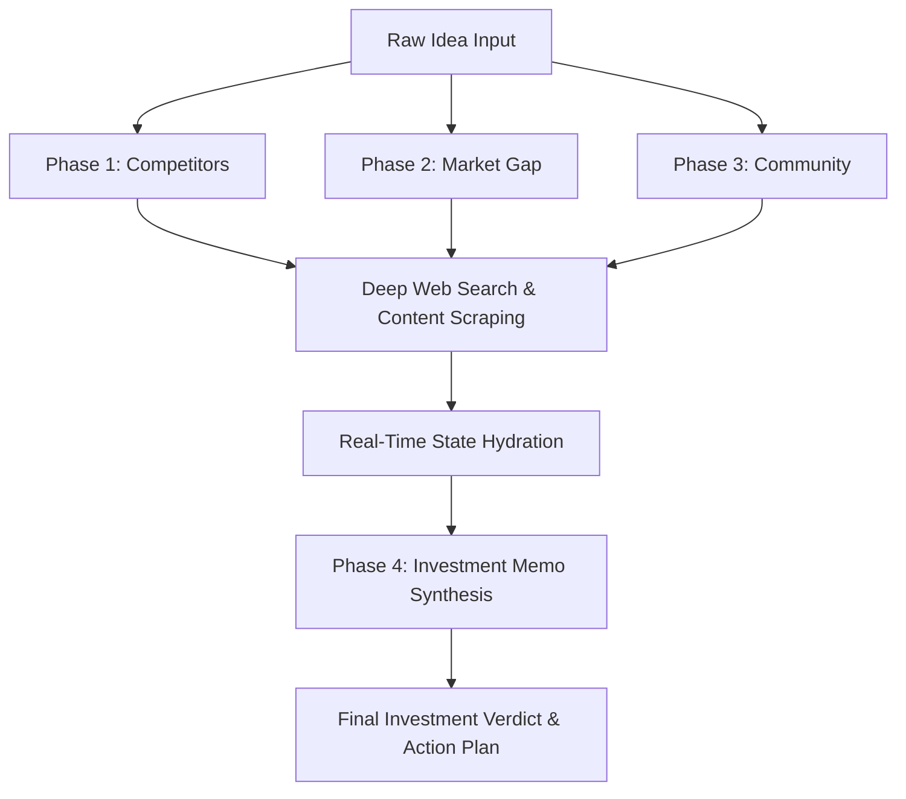

# Convix Idea Lab: Production-Grade AI Startup Validation Engine

> **The strategic validation platform for high-conviction builders.**
> Validate startup ideas, competitive landscapes, market gaps, and real-world community sentiment before writing a single line of product code.

---

## ⚡ The Convix Thesis

Most startups fail not from a lack of builder dedication, but because they build something the market does not need. **Convix Idea Lab** acts as an AI-native research department that interrogates, analyzes, and stresses startup ideas through an orchestrated swarm of web-scraping and reasoning agents.

By processing structured search matrices across competitive spaces, customer complaints, and market signals in real-time, Convix provides founders with the raw, unfiltered truth—backed by traceable sources—packaged into an institutional-grade investment memo.

---

## 🚀 Orchestrated 4-Phase Pipeline Architecture

Convix does not rely on simple LLM prompts. It executes a stateful, parallelized **4-Phase Research Pipeline** that guarantees multi-dimensional validation:



### 🔬 Detailed Phase Execution List
1. **Phase 1: Competitor Landscape Analysis**
   * **Mission:** Discover direct/indirect competitors, product offerings, and current market capture.
   * **AI Operations:** The research agent constructs search matrices, crawls landing pages, and maps active competitor positioning.
2. **Phase 2: Market Gap Discovery**
   * **Mission:** Locate competitive vulnerabilities, unserved niches, and unique value hooks.
   * **AI Operations:** Processes scraped target content to highlight features, price gaps, and structural inefficiencies of market incumbents.
3. **Phase 3: Organic Community Sentiment**
   * **Mission:** Gather authentic qualitative data directly from discussions on high-intent channels.
   * **AI Operations:** Mines Reddit, Hacker News, Quora, and industry-specific forums to extract raw user frustrations, feedback, and wishlist items.
4. **Phase 4: Synthesis & Final Executive Verdict**
   * **Mission:** Harmonize all research logs into a highly actionable, structured strategic memo.
   * **AI Operations:** Performs full-context reasoning via custom-tuned expert models (Claude/Gemini) to output a complete, publication-ready analysis.

---

## 🎨 High-Fidelity UI/UX & Real-Time Blueprint Visualizer

* **The Research Canvas:** An interactive, node-based SVG workspace designed from scratch to visualize the AI's crawling process.
  * **Dynamic User State:** The central "Input Idea" node is dynamically hydrated with the user's raw prompt.
  * **Full Repositioning Control:** Drag-and-drop nodes to customize your research layout dynamically.
  * **Hover Detail Cards:** Interactive source cards display web favicons, domain tracking tags, and snippet previews for a rich, descriptive user experience.
* **Premium Cinematic SaaS Aesthetics:** A minimal, dark-mode-first editorial design built with Vanilla CSS, glassmorphism overlays, custom scrollbars, and sleek micro-animations using Framer Motion (`motion/react`).
* **Adaptive Navigation:** Premium, responsive layouts optimized for all viewport states. The mobile header collapses neatly, housing the premium CTA "Build Smarter" button inside the mobile drawer under Contact.

---

## 🔒 Enterprise-Grade Stability & Resilient Infrastructure

* **Cascading Timeout Fallbacks (`Promise.race`):** External APIs (Tavily/OpenRouter) are wrapped in custom timeout middleware (15s for search/scrape, 180s for massive synthesis), preventing infinite pending states and conserving token budgets.
* **Proactive Rate Limiting:** Server-side usage-based rate limits protect the database and compute infrastructure, failing open gracefully during database downtime to ensure uninterrupted developer UX.
* **Lenis Smooth Scroll Protection:** Implements precise `data-lenis-prevent="true"` properties across scrollable containers to completely resolve touchpad and mouse-wheel scrolling conflicts common in smooth-scrolling containers.
* **Cloud-Native Deployment (Google Cloud Run):**
  * Multi-stage `Dockerfile` compiles static assets via Vite and packages them alongside an Express Node runtime.
  * Dynamically binds to host `0.0.0.0` on port `8080`, ready for frictionless production deployment.

---

## 🛠️ Tech Stack & Key Integrations

| Layer | Technology | Purpose |
| :--- | :--- | :--- |
| **Frontend Core** | React 18, Vite, TypeScript | Modern, high-performance SPA foundation |
| **Visuals & Layout**| Tailwind CSS, Vanilla HSL variables | Dynamic light/dark theme system |
| **Motion & Icons** | Framer Motion, Lucide Icons | Fluid micro-interactions and iconography |
| **Backend API** | Node.js, Express, TypeScript | Highly responsive API layer |
| **Orchestration** | OpenRouter SDK | Unified dynamic model routing (Claude 3.5 Sonnet / Gemini Pro) |
| **Web Research** | Tavily Search API | Deep web-mining and page content extraction |
| **Auth & Data** | Supabase, PostgreSQL | Secure RLS user auth, usage metrics, and history logs |

---

## ⚙️ Local Installation & Development

### Prerequisites
* Node.js v20 or higher installed.
* Active Supabase instance.
* API keys for OpenRouter and Tavily.

### Setup Steps

1. **Clone & Install Dependencies:**
   ```bash
   git clone https://github.com/ThiefRiefMarhas/convix-lab.git
   cd convix-lab
   npm install
   ```

2. **Configure Environment Variables:**
   Create a `.env` file in the root of the project:
   ```env
   # Supabase Credentials
   VITE_SUPABASE_URL=your_supabase_project_url
   VITE_SUPABASE_ANON_KEY=your_supabase_anon_key
   SUPABASE_SERVICE_ROLE_KEY=your_supabase_service_role_key

   # AI and Search Providers
   OPENROUTER_API_KEY=your_openrouter_api_key
   OPENROUTER_BASE_URL=https://openrouter.ai/api/v1
   TAVILY_API_KEY=your_tavily_api_key

   # Server Config
   PORT=3000
   ```

3. **Start Local Development Environment:**
   ```bash
   npm run dev
   ```
   *Runs frontend HMR server and backend API concurrently.*

4. **Verify Production Build Locally:**
   ```bash
   npm run build
   npm start
   ```

---

## 📦 Docker & Production Build Verification

### Local Container Build
To package and verify the container:
```bash
docker build -t convix-lab .
docker run -p 8080:8080 --env-file .env convix-lab
```
Open [http://localhost:8080](http://localhost:8080) to confirm container health.

### Deployment to Google Cloud Run
Deploying the pre-configured container is simple:
```bash
gcloud builds submit --tag gcr.io/your-project-id/convix-lab
gcloud run deploy convix-lab --image gcr.io/your-project-id/convix-lab --platform managed --port 8080
```

---

## 👨‍💻 Founder & Builder

**Arief Fajar**
* *Founder & Builder — Convix Software*
* Margahayu, Indonesia
* [Instagram](https://instagram.com/arief.fajr) · [LinkedIn](https://www.linkedin.com/in/arief-fajar-a76855390) · [Email](mailto:arieffajarmarhas@gmail.com)

---
*Designed and built with absolute strategy, zero hype.*
