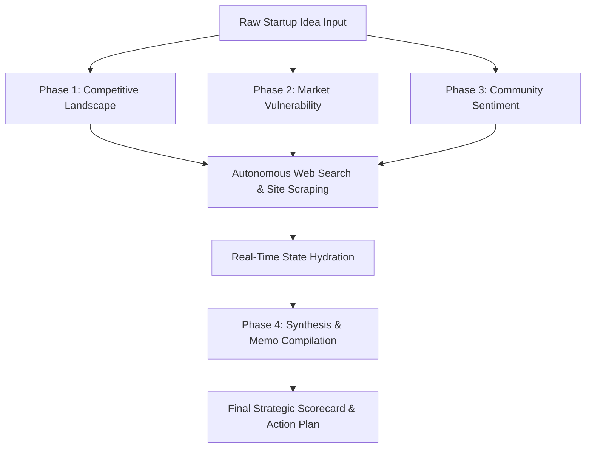

# 🏛️ Convix Idea Lab: Production-Grade AI Startup Validation Engine

[](https://github.com/ThiefRiefMarhas/convix-lab)
[](https://vite.dev/)
[](https://react.dev/)
[](https://tailwindcss.com/)
[](https://supabase.com/)
[](#-multilingual-i18n-engine)
[](LICENSE)

> **Convix Idea Lab** is a high-fidelity, production-grade artificial intelligence validation engine designed for early-stage startup concepts. It acts as an automated market research and analysis department, executing deep, multi-phase audits across competitor landscapes, market vulnerabilities, and organic community discussions before resources are committed to software development.

---

## 🧭 Architectural Overview

Convix does not rely on static LLM prompts. It employs a stateful, parallelized multi-agent workflow that crawls real-time indices, gathers qualitative user feedback from high-intent forums, and synthesizes structured investment memos.



### 🔬 Stateful 4-Phase Research Pipeline

1.  **Phase 1: Competitive Landscape Audit**
    *   **Objective:** Identify direct, indirect, and adjacent competitors.
    *   **Operations:** Constructs search matrices to query Tavily API, parses landing page content, and maps active competitor positioning.
2.  **Phase 2: Market Vulnerability Discovery**
    *   **Objective:** Uncover pricing discrepancies, feature gaps, and structural inefficiencies of incumbents.
    *   **Operations:** Evaluates crawled target data to isolate unserved market segments and strategic value hooks.
3.  **Phase 3: Qualitative Community Mining**
    *   **Objective:** Gather unfiltered user frustrations and demand signals.
    *   **Operations:** Crawls communities such as Reddit, Hacker News, and industry forums to extract real-world complaints and wishlist items.
4.  **Phase 4: Synthesis & Memo Compilation**
    *   **Objective:** Generate a comprehensive, investor-ready market validation report.
    *   **Operations:** Uses high-context models (Claude 3.5 Sonnet / Gemini Pro) to cross-reference gathered data and output an executive evaluation.

---

## 🛠️ Technology Stack & System Requirements

### Core Technology Matrix

| Layer | Technology | Purpose |
| :--- | :--- | :--- |
| **Frontend Core** | React 19, Vite 6, TypeScript 5 | High-performance SPA foundation |
| **State & Styling** | Tailwind CSS, HSL CSS variables | Seamless Light/Dark theme transition |
| **Visual Layer** | Framer Motion, Lucide React | Hardware-accelerated fluid micro-interactions |
| **Backend Core** | Node.js, Express, tsx | Modern TypeScript API execution runtime |
| **Web Crawling** | Tavily Search & Cheerio | Real-time web-scraping and page extraction |
| **Orchestration** | OpenRouter SDK | Dynamic, fault-tolerant model routing |
| **Data & Auth** | Supabase, PostgreSQL | Relational storage, Row Level Security (RLS) |

### System Requirements
*   **Node.js**: `^20.0.0` or higher
*   **Package Manager**: `npm` or `yarn`
*   **Database**: PostgreSQL compatible database (configured for Supabase RLS)

---

## 🔒 Security, Integrity & Resilient Design

*   **Server-Sent Events (SSE) Keep-Alive:** Long-running web validation processes are protected against NAT/proxy timeout drops via a robust 15-second server heartbeat signal and TCP-level socket configuration (`setKeepAlive(true, 1000)`).
*   **Cascading Fallback Mechanisms (`Promise.race`):** External network requests are wrapped in custom timeouts (15 seconds for search/scrape actions, 180 seconds for synthesis) to prevent thread blockages.
*   **Bilateral Redirect Guards:** Protected app routes feature custom state-transition locks inside the authentication layer to handle modal closures cleanly without freezing the user interface on cancelled attempts.
*   **Lenis Scroll Integration:** Scrollable panels employ `data-lenis-prevent="true"` properties to resolve touch and trackpad event propagation conflicts.

---

## 📦 Directory Structure

```directory
convix-idea-lab/
├── public/                 # Static assets, sitemap.xml, robots.txt, manifest.json
├── src/
│   ├── components/         # Reusable UI components
│   │   ├── auth/           # AuthModal, ProtectedRoute
│   │   ├── chat/           # ChatPanel, ExportModal, ResearchCanvas, SWOTPanel
│   │   ├── landing/        # CinematicHero, Landing layout components
│   │   └── ui/             # Dynamic buttons, icons, indicators
│   ├── context/            # Global context providers (Auth, Theme, Locale)
│   ├── hooks/              # Custom React hooks (useChat, useConversations)
│   ├── i18n/               # Localization strings (ui.ts)
│   ├── layouts/            # Page layouts
│   ├── lib/                # Shared utilities (supabase client, error utilities)
│   ├── pages/              # Main view entrypoints (Home, About, Dashboard, Legal)
│   ├── services/           # API request layer
│   ├── App.tsx             # Root Application Component
│   ├── AppRoutes.tsx       # Page routing definition
│   ├── index.css           # Core styling, variables, theme overrides
│   └── main.tsx            # DOM mounting and initiation
├── server/                 # Express API server (Node.js runtime)
│   ├── middleware/         # Auth verify, rate limiters
│   ├── routes/             # API Router files (chat, upload, export, swot, etc.)
│   ├── services/           # Back-end services (openrouter, tavily, scraper)
│   └── prompts/            # Tuned system prompt guidelines for LLM
├── supabase/               # Database migrations and seed definitions
├── Dockerfile              # Cloud-native build instructions
├── package.json            # Manifest file for scripts and dependencies
└── tsconfig.json           # TypeScript compilation configuration
```

---

## 📡 API Specification (Core Endpoints)

### 1. Start Analysis Pipeline
*   **Endpoint:** `POST /api/chat`
*   **Headers:** `Content-Type: application/json`, `Authorization: Bearer <JWT>`
*   **Payload:**
    ```json
    {
      "message": "A marketplace for upcycled local Indonesian furniture.",
      "conversationId": "uuid-string-or-null",
      "enableWebSearch": true
    }
    ```
*   **Response:** Stream of Server-Sent Events (SSE) representing phase progression, discovered sources, and generated tokens.

### 2. Retrieve SWOT Analysis
*   **Endpoint:** `GET /api/swot/:conversationId`
*   **Response Format:**
    ```json
    {
      "strengths": [{"text": "String", "score": 8, "evidence": "String"}],
      "weaknesses": [{"text": "String", "score": 6, "evidence": "String"}],
      "opportunities": [{"text": "String", "score": 9, "evidence": "String"}],
      "threats": [{"text": "String", "score": 5, "evidence": "String"}],
      "overall_score": 75,
      "ai_summary": "Overall execution summary."
    }
    ```

---

## ⚙️ Local Installation & Development

1.  **Clone the Repository & Install Dependencies:**
    ```bash
    git clone https://github.com/ThiefRiefMarhas/convix-lab.git
    cd convix-lab
    npm install
    ```

2.  **Configure Environment Variables:**
    Create a `.env` file in the project root:
    ```env
    # Supabase Database Configuration
    VITE_SUPABASE_URL=your_supabase_project_url
    VITE_SUPABASE_ANON_KEY=your_supabase_anon_key
    SUPABASE_SERVICE_ROLE_KEY=your_supabase_service_role_key

    # AI Model and Search Providers
    OPENROUTER_API_KEY=your_openrouter_api_key
    OPENROUTER_BASE_URL=https://openrouter.ai/api/v1
    TAVILY_API_KEY=your_tavily_api_key

    # Express Server Port Config
    PORT=3000
    ```

3.  **Start Local Development Environment:**
    ```bash
    npm run dev
    ```
    *Runs the frontend HMR server and backend Express API concurrently.*

4.  **Verify Production Build:**
    ```bash
    npm run build
    npm start
    ```

---

## 📦 Containerization & Deployment

### Production Container Build
To package and verify the container locally:
```bash
docker build -t convix-lab .
docker run -p 8080:8080 --env-file .env convix-lab
```
Open [http://localhost:8080](http://localhost:8080) to verify container health status.

### Google Cloud Run Deployment
Deploy the container with a single execution step:
```bash
gcloud builds submit --tag gcr.io/your-project-id/convix-lab
gcloud run deploy convix-lab --image gcr.io/your-project-id/convix-lab --platform managed --port 8080
```

---

## 👨‍💻 Founder & Developer

**Arief Fajar**
* *Founder & Builder — Convix Software*
* Margahayu, Indonesia
* [Instagram](https://instagram.com/arief.fajr) · [LinkedIn](https://www.linkedin.com/in/arief-fajar-a76855390) · [Email](mailto:arieffajarmarhas@gmail.com)

---
*Designed and built with absolute strategy, zero hype.*
