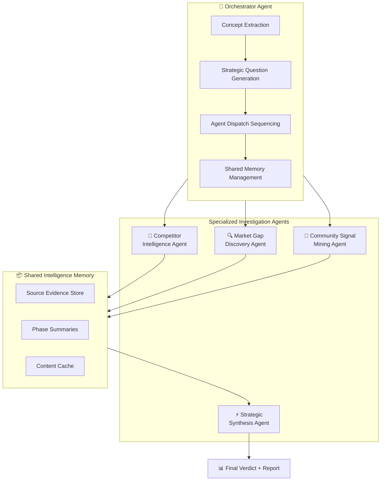
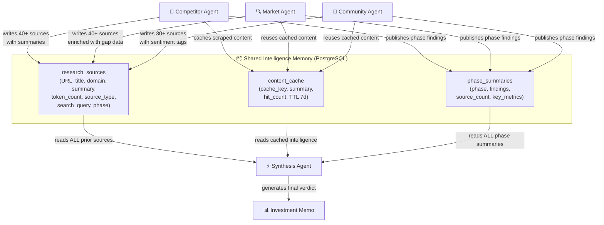
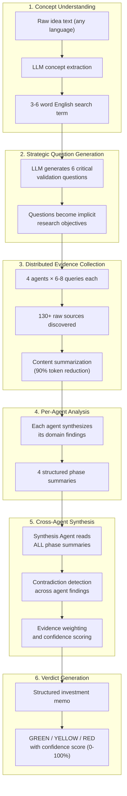
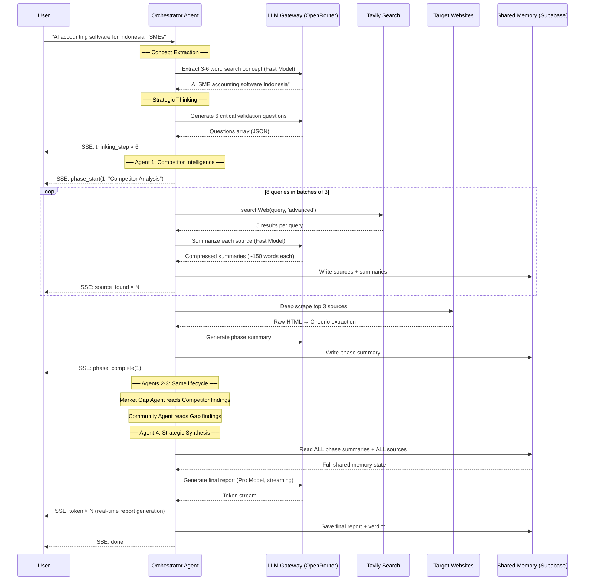

<p align="center">
  
</p>

<h1 align="center">Convix Idea Lab</h1>

<p align="center">
  <strong>Autonomous Multi-Agent Market Intelligence System</strong>
</p>

<p align="center">
  Convix deploys specialized AI research agents that autonomously investigate markets, analyze competitors, detect demand signals from real communities, and generate investor-grade startup validation reports — without human intervention.
</p>

<p align="center">
  <a href="https://github.com/ThiefRiefMarhas/convix-lab"></a>
  
  
  
  
  <a href="#"></a>
</p>

<br/>

```
User: "AI-powered accounting software for Indonesian SMEs"
                              │
                    ┌─────────▼──────────┐
                    │  Orchestrator Agent │ ← Concept extraction, strategic question generation
                    └─────────┬──────────┘
          ┌───────────────────┼───────────────────┐
          ▼                   ▼                   ▼
┌─────────────────┐ ┌─────────────────┐ ┌─────────────────┐
│  Competitor      │ │  Market Gap      │ │  Community       │
│  Intelligence    │ │  Discovery       │ │  Signal Mining   │
│  Agent           │ │  Agent           │ │  Agent           │
│  (40+ sources)   │ │  (40+ sources)   │ │  (30+ sources)   │
└────────┬────────┘ └────────┬────────┘ └────────┬────────┘
         │                   │                   │
         └───────────────────┼───────────────────┘
                    ┌────────▼────────┐
                    │  Strategic       │
                    │  Synthesis Agent │ ← Cross-references all agent findings
                    └────────┬────────┘
                    ┌────────▼────────┐
                    │  [VERDICT:GREEN] │
                    │  82% viability   │
                    │  134 sources     │
                    └─────────────────┘
```

<p align="center">
  <a href="#-multi-agent-architecture">Agent Architecture</a> •
  <a href="#-inter-agent-communication--shared-memory">Communication</a> •
  <a href="#-reasoning-architecture">Reasoning</a> •
  <a href="#-example-investigation-flow">Example</a> •
  <a href="#-quickstart">Quickstart</a>
</p>

---

## Table of Contents

- [Why Traditional AI Fails](#-why-traditional-ai-fails)
- [Multi-Agent Architecture](#-multi-agent-architecture)
- [Inter-Agent Communication \& Shared Memory](#-inter-agent-communication--shared-memory)
- [Reasoning Architecture](#-reasoning-architecture)
- [Example Investigation Flow](#-example-investigation-flow)
- [System Architecture](#-system-architecture)
- [AI Orchestration Layer](#-ai-orchestration-layer)
- [Operational Metrics](#-operational-metrics)
- [API Overview](#-api-overview)
- [Technology Stack](#-technology-stack)
- [Quickstart](#-quickstart)
- [Deployment](#-deployment)
- [Agent Reliability \& Fault Tolerance](#-agent-reliability--fault-tolerance)
- [Roadmap](#-roadmap)
- [Contributing](#-contributing)
- [Founder \& Contact](#-founder--contact)
- [License](#-license)

---

## 🔍 Why Traditional AI Fails

Market validation is not a single-prompt task. It is a multi-dimensional research operation that requires specialized reasoning across different domains simultaneously.

### The Failure Modes of Conventional AI Systems

| Approach | Failure Mode | Consequence |
| :--- | :--- | :--- |
| **Single LLM prompt** | Generates plausible-sounding but ungrounded opinions | No evidence, pure hallucination risk |
| **RAG chatbot** | Retrieves fragments but cannot reason across domains | Answers questions but doesn't _investigate_ |
| **Chain-of-thought** | Linear reasoning with no parallelism or specialization | Misses lateral insights, slow execution |
| **Manual research** | Human analyst with Google + spreadsheets | 6+ weeks, expensive, biased, non-reproducible |

### Why Multi-Agent Architecture Is Required

Startup validation requires four fundamentally different types of intelligence operating in concert:

1. **Competitive Intelligence** — Who exists in this market? How are they funded? What are their weaknesses?
2. **Market Structure Analysis** — Where are the gaps? What is the pricing landscape? What is the TAM?
3. **Qualitative Demand Mining** — What are real users complaining about? What do they wish existed?
4. **Strategic Synthesis** — Given all evidence, is this a green-light opportunity? What is the recommended entry niche?

No single AI call can do this. Convix solves it through **coordinated specialized agents**, each with distinct objectives, search strategies, and reasoning mandates, all sharing evidence through a structured memory layer.

---

## 🤖 Multi-Agent Architecture

Convix operates as a coordinated multi-agent system. Each agent is a specialized reasoning unit with a defined role, unique search strategy, independent evidence collection capability, and structured output format. The **Orchestrator Agent** coordinates execution, manages shared memory, and sequences agent activation.

### Agent Overview



### Agent Specification Table

| Agent | Role | Autonomy | Search Queries | Typical Sources | Input | Output |
| :--- | :--- | :--- | :---: | :---: | :--- | :--- |
| **Orchestrator** | Coordinates all agent execution, manages shared memory, sequences reasoning stages | Full — initiates entire investigation | 0 (delegates) | 0 | Raw user idea + conversation history | Extracted search concept, 6 strategic questions, agent dispatch signals |
| **Competitor Intelligence** | Discovers direct, indirect, and adjacent competitors; maps their positioning | Autonomous search + scrape | 8 parallel | ~40 | Search concept from Orchestrator | Competitor landscape with funding data, feature sets, weaknesses |
| **Market Gap Discovery** | Identifies pricing gaps, feature gaps, unmet needs, and structural market inefficiencies | Autonomous search + scrape | 8 parallel | ~40 | Search concept + Competitor findings (via shared memory) | Gap analysis with estimated revenue potential per gap |
| **Community Signal Mining** | Extracts unfiltered user frustrations, demand signals, and wishlist items from forums | Autonomous targeted search | 8 parallel | ~30 | Search concept + gap data (via shared memory) | Quoted user frustrations, demand themes, complaint patterns |
| **Strategic Synthesis** | Cross-references all agent findings to generate the final investor-grade verdict | Full — reads entire shared memory | 6 parallel | ~20 | All prior agent outputs + shared memory | Structured investment memo with GREEN/YELLOW/RED verdict |

### Agent Lifecycle

Each investigation agent follows a consistent execution lifecycle:

```
1. ACTIVATION       Orchestrator dispatches agent with search concept
        │
2. QUERY PLANNING   Agent generates 6–8 domain-specific search queries
        │
3. EVIDENCE         Execute queries in parallel batches of 3
   COLLECTION       │── Tavily advanced search (5 results per query)
        │           │── Content summarization via fast LLM
        │           └── Source deduplication + cache check
        │
4. DEEP SCRAPE      Select top 3 highest-signal sources for full extraction
        │           │── Cheerio HTML parsing (semantic element priority)
        │           └── AI-powered content summarization
        │
5. PHASE SUMMARY    Synthesize all collected evidence into a structured brief
        │           │── LLM-generated summary (max 200 words)
        │           └── Key findings extraction
        │
6. MEMORY COMMIT    Write all findings to shared intelligence memory
        │           │── Sources saved to research_sources table
        │           │── Summaries saved to content_cache
        │           └── Phase summary published via SSE
        │
7. HANDOFF          Signal completion to Orchestrator for next agent dispatch
```

### Agent Persona System

Each agent operates under a distinct AI persona that shapes its reasoning behavior:

**Brainstorm Persona** (pre-analysis conversational agent):
> _"You are **Convix Intelligence** — a sharp, no-BS startup validation partner. You drive the conversation. Ask ONE question at a time to understand the idea deeply. Keep responses to 1-3 sentences. Be warm but direct — like a smart co-founder, not a chatbot."_

**Analysis Persona** (activated for all investigation agents):
> _"You are **Convix Intelligence** — a Senior Strategic Analyst at a top-tier VC firm conducting market validation. Open with a bold verdict immediately. Be BLUNT and DIRECT — no hedging. Use SPECIFIC numbers always. Reference companies BY NAME. Include ONE unexpected insight the founder hasn't considered."_

The brainstorm persona automatically transitions to the analysis persona after 3+ conversational turns, enabling the system to gather sufficient context before deploying the full agent swarm.

---

## 🔗 Inter-Agent Communication & Shared Memory

**This is not a single LLM call.** Convix implements a structured inter-agent communication system where each agent both produces and consumes intelligence through a shared memory layer.

### Communication Architecture



### Evidence Propagation Model

Evidence flows through the system in three stages:

**Stage 1 — Raw Collection.** Each agent independently collects evidence from the web. Sources are stored with full provenance: URL, title, domain, raw content, AI-generated summary, token count, source type (tavily/community/scrape), and the originating search query.

**Stage 2 — Summarization & Caching.** Raw web content (avg. 5,000 characters) is compressed into AI-generated summaries (~500 characters) through the content pipeline. Summaries are cached with a 7-day TTL and composite key `(cache_type, cache_key)`. Subsequent agents hitting the same URL retrieve the cached summary at zero LLM cost. This yields a **90% token reduction** across the system.

**Stage 3 — Cross-Agent Synthesis.** The Strategic Synthesis Agent reads the entire shared memory — all source summaries, all phase summaries, all cached intelligence — and cross-references findings across agents. It detects contradictions (e.g., Competitor Agent found low competition but Community Agent found high frustration → underserved niche signal), resolves conflicting evidence, and produces the final verdict.

### Structured Intelligence Objects

Each agent produces and consumes structured intelligence objects:

```typescript
// What each agent writes to shared memory
interface AgentIntelligence {
  phase: number;                          // 1-4
  name: string;                           // "Competitor Analysis" | "Market Gap" | ...
  sources: Array<{
    url: string;                          // Evidence provenance
    title: string;                        // Source title
    domain: string;                       // Extracted domain
    snippet: string;                      // Raw excerpt (200 chars)
    summary: string;                      // AI-generated compressed summary
    fromCache: boolean;                   // Whether this was a cache hit
  }>;
  phaseSummary: string;                   // LLM-generated phase-level findings
}

// What the Synthesis Agent reads
interface SharedMemoryState {
  phaseResults: AgentIntelligence[];      // All 4 agent outputs
  totalSources: number;                   // Sum of all collected sources
  searchConcept: string;                  // Extracted business concept
  conversationHistory: string;            // Full brainstorm context
}
```

### Contextual Reasoning Transfer

Agents do not operate in isolation. Each agent's output enriches the reasoning context for downstream agents:

| Producer Agent | Downstream Consumer | What Is Transferred |
| :--- | :--- | :--- |
| Orchestrator → All Agents | Competitor, Market, Community, Synthesis | Extracted search concept (3-6 word English term), 6 strategic research questions |
| Competitor Agent → Market Agent | Market Gap Discovery | Competitor landscape establishes the baseline against which gaps are measured |
| Market Agent → Community Agent | Community Signal Mining | Identified gaps inform which community complaints are actionable |
| All Agents → Synthesis Agent | Strategic Synthesis | Full evidence corpus — all sources, summaries, and phase findings are cross-referenced |

---

## 🧠 Reasoning Architecture

Convix implements a structured multi-stage reasoning system designed to maximize evidence quality, minimize hallucination, and produce traceable conclusions.

### Reasoning Lifecycle



### Reasoning Principles

| Principle | Implementation |
| :--- | :--- |
| **Evidence Grounding** | Every claim in the final report traces back to a specific URL source with an AI-generated summary. No unsourced assertions. |
| **Hallucination Resistance** | Agents search the live web and extract real data. The Synthesis Agent is instructed to use SPECIFIC numbers, reference companies BY NAME, and cite dollar amounts — forcing grounded outputs. |
| **Contradiction Detection** | The Synthesis Agent cross-references findings across all 4 agents. If Competitor Agent finds "few competitors" but Community Agent finds "high user frustration," the system identifies this as an underserved niche signal rather than a contradiction. |
| **Confidence Scoring** | The final verdict includes a viability score (0-100%) derived from source quantity, evidence consistency, market size signals, and competitive density. |
| **Traceability** | All 130+ sources are persisted in `research_sources` with full metadata (URL, domain, search query, phase, summary, token count). Users can audit every claim back to its origin. |
| **Bilingual Reasoning** | Automatic Indonesian/English detection locks the entire reasoning chain to the user's language, including thinking questions, phase summaries, and the final report. |

### Pre-Investigation Thinking Phase

Before dispatching any research agents, the Orchestrator runs a **deliberate thinking phase** where it formulates strategic research questions:

```
Orchestrator receives: "AI accounting software for Indonesian SMEs"

Thinking Phase Output (streamed to user in real-time):
  1. "What are the existing cloud accounting solutions in Indonesia?"
  2. "Who are the top 3 competitors and what is their funding?"
  3. "What is the estimated TAM for SME accounting in Southeast Asia?"
  4. "Are there regulatory barriers (e.g., tax compliance requirements)?"
  5. "What technology infrastructure do Indonesian SMEs typically have?"
  6. "Is the timing right — is this market growing or saturating?"
```

These questions serve two purposes:
1. **User transparency** — the user sees _what_ the system is about to investigate and _why_
2. **Research scoping** — the questions implicitly guide agent search strategies

### Token Budget Intelligence

The system implements a 30,000-token budget allocation system that prevents context window overflow during multi-agent reasoning:

```
Total Budget: 30,000 tokens per reasoning turn
├── System Prompt (Agent Persona):    1,000 tokens (fixed)
├── Conversation History:             8,000 tokens (first + last N messages)
├── File Context (uploaded PDFs):     3,000 tokens (truncated)
├── Agent Tool Results:               6,000 tokens (search + scrape summaries)
└── Response Generation Reserve:     12,000 tokens (AI output space)
```

When the tool result budget is exhausted (`< 500 tokens remaining`), the Orchestrator dynamically disables tool access for the current agent, forcing it to reason from already-collected evidence. This prevents budget overruns while maximizing evidence utilization.

---

## 📋 Example Investigation Flow

### Input

> _"AI-powered accounting software for Indonesian SMEs"_

### Execution Trace

```
═══════════════════════════════════════════════════════════════
  ORCHESTRATOR AGENT — Concept Extraction
═══════════════════════════════════════════════════════════════

  Input:  "AI-powered accounting software for Indonesian SMEs"
  Action: LLM concept extraction (Gemini 2.5 Flash, 100 tokens)
  Output: "AI SME accounting software Indonesia"

═══════════════════════════════════════════════════════════════
  ORCHESTRATOR AGENT — Strategic Question Generation
═══════════════════════════════════════════════════════════════

  Generates 6 questions for research scoping:
    → "Apa solusi akuntansi cloud yang sudah ada di Indonesia?"
    → "Siapa 3 kompetitor teratas dan berapa pendanaan mereka?"
    → "Berapa estimasi TAM untuk akuntansi UKM di Asia Tenggara?"
    → "Apakah ada hambatan regulasi seperti kepatuhan pajak?"
    → "Infrastruktur teknologi apa yang dimiliki UKM Indonesia?"
    → "Apakah pasar ini sedang tumbuh atau sudah jenuh?"
  (Questions auto-detected as Indonesian based on input language)

═══════════════════════════════════════════════════════════════
  COMPETITOR INTELLIGENCE AGENT — Phase 1
═══════════════════════════════════════════════════════════════

  Search queries executed (8 parallel, batches of 3):
    → "AI SME accounting software Indonesia competitors startups"
    → "AI SME accounting software Indonesia alternatives"
    → "AI SME accounting software Indonesia market leaders"
    → "AI SME accounting software Indonesia funding raised"
    → "AI SME accounting software Indonesia reviews comparison"
    → "best AI SME accounting tools platforms 2025 2026"
    → "AI SME accounting software Indonesia industry landscape"
    → "AI SME accounting software Indonesia similar apps"

  Sources discovered: 43
  Cache hits: 7 (from prior investigations)
  Deep scrapes: 3 (jurnal.id, mekari.com, bukukas.co.id)

  Phase Summary → Shared Memory:
    "Found 6 major competitors: Jurnal.id (Series B, $10M),
     Mekari (raised $50M+), BukuKas, Kledo, Accurate, Zahir.
     Market is active with strong funding signals.
     Key weakness: most lack AI-powered features."

═══════════════════════════════════════════════════════════════
  MARKET GAP DISCOVERY AGENT — Phase 2
═══════════════════════════════════════════════════════════════

  Reads: Competitor Agent findings from shared memory
  Search queries: 8 (pricing, unmet needs, TAM, underserved segments)
  Sources discovered: 38
  Deep scrapes: 3

  Phase Summary → Shared Memory:
    "Indonesian SME accounting market estimated at $800M+ TAM.
     Gap identified: AI-powered auto-categorization and
     tax compliance automation are underserved.
     Mobile-first UKM segment (warung/toko) largely ignored
     by enterprise-focused players."

═══════════════════════════════════════════════════════════════
  COMMUNITY SIGNAL MINING AGENT — Phase 3
═══════════════════════════════════════════════════════════════

  Reads: Gap data from shared memory
  Targeted queries: Reddit, HN, ProductHunt, IndieHackers
  Sources discovered: 31
  Deep scrapes: 3

  Phase Summary → Shared Memory:
    "Strong demand signals on r/indonesia and Kaskus:
     'Jurnal is too expensive for my warung'
     'I still do bookkeeping in Excel, need something simpler'
     'Tax reporting is a nightmare, wish it was automated'
     Community frustration concentrated in pricing and complexity."

═══════════════════════════════════════════════════════════════
  STRATEGIC SYNTHESIS AGENT — Phase 4
═══════════════════════════════════════════════════════════════

  Reads: ENTIRE shared memory (all 3 prior agents + all sources)
  Additional queries: 6 (business model, GTM strategy, VC thesis)
  Sources discovered: 22

  Cross-reference analysis:
    ✓ Competitor Agent: 6 funded competitors → market validated
    ✓ Market Agent: mobile-first gap identified → niche available
    ✓ Community Agent: price frustration → pricing wedge opportunity
    ⚠ Contradiction: "active market" vs "underserved segment"
      → Resolved: market is active at enterprise tier,
         underserved at micro-SME tier

═══════════════════════════════════════════════════════════════
  FINAL VERDICT
═══════════════════════════════════════════════════════════════

  [VERDICT:YELLOW] — 68% viability score

  134 sources analyzed across 4 agents.

  "Crowded market at the enterprise tier, but a clear gap
   exists in mobile-first AI accounting for micro-SMEs
   (warung/toko). Recommended entry: freemium mobile app
   with AI auto-categorization and automated SPT tax filing.
   Estimated Year 1 revenue potential: $200K-$500K MRR
   if capturing 2% of the 64M Indonesian MSME market."

  Next Steps:
    1. Build MVP targeting warung owners with WhatsApp integration
    2. Partner with Indonesian tax consultants for SPT compliance
    3. Post on r/indonesia and Kaskus for early user validation
    4. Apply to Y Combinator W27 with Southeast Asia thesis
    5. Contact Jurnal.id's churned SME customers for interviews
```

---

## 🏗 System Architecture

### Agent-Centric Architecture Overview

```
┌──────────────────────────────────────────────────────────────────┐
│                     USER INTERACTION LAYER                        │
│  Natural language input → SSE real-time agent status stream      │
│  Research Canvas (interactive SVG source graph)                   │
└──────────────────────────┬───────────────────────────────────────┘
                           │ SSE Stream / REST
┌──────────────────────────┼───────────────────────────────────────┐
│                  AGENT ORCHESTRATION LAYER                        │
│                                                                   │
│  ┌─────────────────────────────────────────────────────────┐     │
│  │  Orchestrator Agent (server/services/analysis-pipeline)  │     │
│  │  ├── Concept Extraction (LLM: Fast Model)               │     │
│  │  ├── Strategic Question Generation (LLM: Fast Model)    │     │
│  │  ├── Agent Dispatch Sequencer (4 phases)                │     │
│  │  ├── Shared Memory Manager (Supabase writes)            │     │
│  │  └── Report Compiler (LLM: Pro Model, streaming)        │     │
│  └────────────────────────┬────────────────────────────────┘     │
│                           │                                       │
│  ┌────────────────────────┼────────────────────────────────┐     │
│  │  Agent Capabilities                                      │     │
│  │  ├── tavily_search → Web intelligence gathering         │     │
│  │  ├── scrape_website → Deep content extraction           │     │
│  │  ├── summarize → Content compression (90% reduction)    │     │
│  │  └── phase_summary → Cross-source synthesis             │     │
│  └────────────────────────┼────────────────────────────────┘     │
│                           │                                       │
│  ┌────────────────────────┼────────────────────────────────┐     │
│  │  Context & Reasoning Engine                              │     │
│  │  ├── context-builder → Token budget allocation (30K)    │     │
│  │  ├── content-pipeline → Summarize + cache + deduplicate │     │
│  │  └── openrouter → Multi-model gateway with fallbacks    │     │
│  └─────────────────────────────────────────────────────────┘     │
│                                                                   │
└──────────────────────────┬───────────────────────────────────────┘
                           │
┌──────────────────────────┼───────────────────────────────────────┐
│               SHARED INTELLIGENCE MEMORY                         │
│  ├── research_sources (evidence store — 130+ per investigation) │
│  ├── content_cache (summarized web data — 7-day TTL)            │
│  ├── conversations + messages (reasoning history)                │
│  ├── swot_analyses (structured SWOT output)                     │
│  └── conversation_insights (verdict + metrics)                   │
└──────────────────────────┬───────────────────────────────────────┘
                           │
┌──────────────────────────┼───────────────────────────────────────┐
│               EXTERNAL INTELLIGENCE SERVICES                     │
│  ├── OpenRouter (Claude Opus 4.6 / Gemini 3.1 Pro / Flash 2.5) │
│  ├── Tavily (Advanced web search with answer extraction)        │
│  └── Target Websites (Cheerio HTML extraction + parsing)        │
└──────────────────────────────────────────────────────────────────┘
```

### Agent Orchestration Sequence



---

## 🎛 AI Orchestration Layer

### Multi-Model Routing with Automatic Failover

The Orchestrator dispatches LLM calls through OpenRouter, which provides unified access to frontier models with automatic fallback chains:

| Agent Role | Primary Model | Fallback Model | Temperature | Max Tokens | Rationale |
| :--- | :--- | :--- | :---: | :---: | :--- |
| **Investigation Agents** (concept extraction, summarization, phase summaries) | Gemini 2.5 Flash | Claude Haiku 4.5 | 0.5 | 4,096 | Speed-optimized for high-volume evidence processing |
| **Strategic Synthesis** (final report generation) | Claude Opus 4.6 | Gemini 3.1 Pro Preview | 0.7 | 8,192 | Depth-optimized for cross-domain reasoning and report quality |
| **Creative Ideation** (alternative perspectives) | Gemini 2.5 Pro | Claude Sonnet 4.6 | 0.8 | 4,096 | Balance of creativity and analytical rigor |

### Adaptive Model Routing

```typescript
// If Claude Opus is rate-limited or unavailable,
// OpenRouter automatically routes to Gemini 3.1 Pro
{
  models: ['anthropic/claude-opus-4.6', 'google/gemini-3.1-pro-preview'],
  // Fallback is transparent — no code changes needed
}
```

### Tool Definitions (Agent Capabilities)

Each investigation agent has access to two tools:

| Tool | Function Signature | Description |
| :--- | :--- | :--- |
| `tavily_search` | `searchWeb(query, search_type)` | Search the live web for market data, competitors, trends, and demand signals |
| `scrape_website` | `scrapeUrl(url, focus?)` | Extract and summarize content from a specific website for deep analysis |

Tools are dynamically enabled or disabled based on the remaining token budget. When the Orchestrator determines that the agent has consumed its tool allocation (`toolBudget < 500 tokens`), it disables tools and forces the agent to reason from already-collected evidence.

---

## 📊 Operational Metrics

### Per-Investigation Performance

| Metric | Typical Value | Description |
| :--- | :--- | :--- |
| **Total Sources Analyzed** | 130–150 | Across all 4 agents |
| **Search Queries Executed** | 30 | 8+8+8+6 across agents |
| **Deep Scrapes Performed** | 12 | Top 3 per agent |
| **Token Reduction (Content Pipeline)** | ~90% | 5,000 chars → 500 chars per source |
| **Cache Hit Rate** | 15–40% | Increases with repeated domain investigations |
| **Agent Execution Time** | 3–5 minutes | Full 4-agent investigation |
| **Final Report Length** | 2,000–4,000 tokens | Structured investment memo |
| **LLM Calls per Investigation** | ~45 | Concept extraction + questions + summaries + phase summaries + final report |

### System Reliability

| Metric | Value | Mechanism |
| :--- | :--- | :--- |
| **Search Timeout Tolerance** | 25 seconds | `Promise.race` with empty-result fallback per query |
| **Scrape Timeout Tolerance** | 10 seconds | `Promise.race` with graceful skip |
| **LLM Timeout Tolerance** | 180 seconds | `AbortController` for long synthesis reports |
| **Model Failover** | Automatic | OpenRouter `models[]` array with 2 models per tier |
| **SSE Connection Stability** | Keep-alive heartbeat every 15s | Prevents NAT/proxy/mobile carrier drops |
| **Content Cache TTL** | 7 days | Prevents redundant summarization of known sources |

---

## 📡 API Overview

All endpoints require JWT authentication via Supabase. The primary endpoint is the SSE-streaming chat endpoint, which is the entry point for agent orchestration.

### Primary: Agent Orchestration Endpoint

**`POST /api/chat`** — Initiates agent reasoning and streams results via Server-Sent Events.

```json
{
  "message": "AI accounting software for Indonesian SMEs",
  "conversationId": "uuid | null",
  "analysisMode": true,
  "locale": "id",
  "attachmentIds": []
}
```

**SSE Events (real-time agent status):**

| Event | Description |
| :--- | :--- |
| `thinking_step` | Orchestrator is generating strategic research questions |
| `phase_start` | Investigation agent N has been dispatched |
| `phase_progress` | Agent reports search/scrape/summarize progress |
| `source_found` | Individual source discovered by an agent |
| `phase_complete` | Agent N completed with summary |
| `analysis_complete` | All 4 agents finished, synthesis beginning |
| `token` | Streaming token from Synthesis Agent's final report |
| `tool_start` / `tool_result` | Agent initiated/completed a tool call |
| `done` | Full investigation complete |

### Supporting Endpoints

| Endpoint | Method | Purpose |
| :--- | :--- | :--- |
| `/api/conversations` | GET/POST/PUT/DELETE | Conversation management |
| `/api/sources/:id` | GET | Retrieve all evidence sources for an investigation |
| `/api/swot/:id` | GET/POST | SWOT analysis for an investigation |
| `/api/insights/:id` | GET | Verdict and metrics for an investigation |
| `/api/export` | POST | Export investigation report (markdown/JSON) |
| `/api/upload` | POST | Upload documents (PDF extraction for agent context) |
| `/api/analytics` | GET | User usage statistics |
| `/api/transcribe` | POST | Audio transcription for voice input |

---

## 🛠 Technology Stack

| Layer | Technology | Role in Agent System |
| :--- | :--- | :--- |
| **Agent Runtime** | Node.js ≥ 20, TypeScript 5.8 | Orchestrator execution environment |
| **LLM Gateway** | OpenRouter SDK | Multi-model routing for agent reasoning (Claude, Gemini) |
| **Web Intelligence** | Tavily 0.7.3 | Advanced search with answer extraction for evidence collection |
| **Content Extraction** | Cheerio 1.2.0, Axios | HTML parsing for deep scrape agent capability |
| **Shared Memory** | Supabase (PostgreSQL) | Evidence store, content cache, phase summaries, RLS |
| **Agent Communication** | Server-Sent Events | Real-time agent status streaming to user |
| **API Server** | Express 4.21.2 | Orchestration endpoint, middleware pipeline |
| **Frontend** | React 19, Vite 6, Tailwind 4 | Research Canvas visualization, agent status UI |
| **Animations** | Motion (Framer) 12.23 | Agent thinking/searching/synthesizing visual feedback |
| **File Processing** | Multer 2.1, pdf-parse 2.4 | Document upload for agent context enrichment |
| **Build** | esbuild 0.25, Vite 6.2 | Production compilation (frontend + backend) |

### Database Schema (Shared Memory)

The shared intelligence memory is backed by PostgreSQL with Row Level Security. Key tables:

| Table | Purpose | Key Columns |
| :--- | :--- | :--- |
| `research_sources` | Evidence store (all agent-discovered sources) | url, title, domain, summary, token_count, source_type, search_query, phase |
| `content_cache` | Deduplicated summarized web content (7-day TTL) | cache_type, cache_key, summary, hit_count, expires_at |
| `conversations` | Investigation sessions | title, model, message_count, source_count, tags |
| `messages` | Agent reasoning history | role, content, metadata (model, tools_used, isAnalysisReport) |
| `swot_analyses` | Structured SWOT output per investigation | strengths, weaknesses, opportunities, threats, overall_score |
| `conversation_insights` | Verdict and metrics | verdict (GREEN/YELLOW/RED), viability_score, key_metrics, difficulty |
| `exports` | Generated reports | format (markdown/json), template, content |

Full ER diagram and migration files available in `supabase/` directory (5 sequential migrations).

---

## 🚀 Quickstart

### Prerequisites

- Node.js ≥ 20.0.0, npm ≥ 9.0.0
- [Supabase](https://supabase.com/dashboard) project (free tier: 500MB DB, 50K auth users)
- [OpenRouter](https://openrouter.ai/keys) API key (pay-per-token, no minimum)
- [Tavily](https://tavily.com) API key (free tier: 1,000 searches/month)

### Setup

```bash
# Clone and install
git clone https://github.com/ThiefRiefMarhas/convix-lab.git
cd convix-lab
npm install

# Configure environment
cp .env.example .env
# Edit .env with your API keys:
#   VITE_SUPABASE_URL, VITE_SUPABASE_ANON_KEY, SUPABASE_SERVICE_ROLE_KEY
#   OPENROUTER_API_KEY, TAVILY_API_KEY

# Run database migrations (execute in order in Supabase SQL Editor)
#   supabase/migration_001_core_schema.sql → migration_005_conversations_trigger.sql

# Start development server (frontend HMR + backend API, single process)
npm run dev
# → http://localhost:3000
```

### Scripts

| Command | Description |
| :--- | :--- |
| `npm run dev` | Development server (Vite HMR + Express) |
| `npm run build` | Production build (Vite frontend + esbuild backend) |
| `npm start` | Run production server (`dist/server.cjs`) |
| `npm run lint` | TypeScript type checking |

---

## 🚢 Deployment

### Docker (Production)

Multi-stage Alpine build for minimal image size:

```bash
docker build -t convix-lab .
docker run -p 8080:8080 --env-file .env convix-lab
```

### Google Cloud Run

```bash
gcloud builds submit --tag gcr.io/YOUR_PROJECT_ID/convix-lab
gcloud run deploy convix-lab \
  --image gcr.io/YOUR_PROJECT_ID/convix-lab \
  --platform managed --port 8080 \
  --memory 512Mi --cpu 1 \
  --min-instances 0 --max-instances 10
```

Production environment variables are injected into `index.html` at serve time via runtime string replacement, enabling environment-specific configuration without rebuilding.

---

## 🛡 Agent Reliability & Fault Tolerance

The agent system is designed for resilient autonomous execution. Each reliability mechanism maps directly to an agent failure mode:

| Failure Mode | Mechanism | Implementation |
| :--- | :--- | :--- |
| Search query hangs | Timeout-bounded execution | `Promise.race` with 25-second window per query; returns empty results on timeout |
| Target website unresponsive | Graceful scrape degradation | `Promise.race` with 10-second window; agent continues with existing evidence |
| LLM provider unavailable | Automatic model failover | OpenRouter `models[]` array routes to fallback model transparently |
| LLM generation hangs | Abort-controlled execution | `AbortController` with 180-second signal terminates and surfaces error |
| SSE connection drops | Persistent heartbeat | `: keep-alive\n\n` comment every 15 seconds prevents proxy/carrier drops |
| TCP socket recycled | OS-level keep-alive | `req.socket.setKeepAlive(true, 1000)` + `setTimeout(0)` prevents recycling |
| Context window overflow | Dynamic tool gating | Tools disabled when budget < 500 tokens; agent reasons from existing evidence |
| Duplicate content processing | Content cache deduplication | `(cache_type, cache_key)` composite unique key with 7-day TTL |
| Rate limit exceeded | Per-user usage tracking | Daily counters for messages, searches, analyses with automatic midnight reset |

---

## 🗺 Roadmap

| Priority | Feature | Status |
| :---: | :--- | :--- |
| 🔴 | **Parallel Agent Execution** — Run Competitor + Market + Community agents simultaneously | Planned |
| 🔴 | **Comparative Analysis** — Deploy agent swarm on 2+ ideas side-by-side | Planned |
| 🟡 | **Agent Memory Persistence** — Long-term cross-investigation knowledge accumulation | Schema Ready |
| 🟡 | **Vector Embeddings** — Semantic source search across investigation history | Schema Ready |
| 🟢 | **Scheduled Monitoring Agents** — Weekly market surveillance with change detection | Planned |
| 🟢 | **Export to PDF** — Branded investment memo template generation | Planned |
| 🟢 | **Real-time Multi-User Collaboration** — WebSocket foundation for shared investigations | Foundation Ready |

---

## 🤝 Contributing

```bash
# Fork → Branch → Develop → Type Check → PR
git checkout -b feature/your-agent-improvement
npm run dev          # Development server
npm run lint         # Type validation
npm run build        # Verify production compilation
git commit -m "feat: add parallel agent execution for Phase 1-3"
```

### Architecture Guidelines

- **Agents** are defined in `server/services/analysis-pipeline.ts` — the core orchestration module
- **Agent personas** are defined in `server/prompts/system.ts` — reasoning instructions for each mode
- **Shared memory** operations go through `server/services/supabase-admin.ts`
- **Content intelligence** (summarization, caching, deduplication) is in `server/services/content-pipeline.ts`
- **Token budget management** is in `server/services/context-builder.ts`
- **Database changes** require a new numbered migration in `supabase/`

---

## 👨‍💻 Founder & Contact

**Arief Fajar** — Founder & Builder, Convix Software
📍 Margahayu, Indonesia

[Instagram](https://instagram.com/arief.fajr) · [LinkedIn](https://www.linkedin.com/in/arief-fajar-a76855390) · [Email](mailto:arieffajarmarhas@gmail.com) · [GitHub](https://github.com/ThiefRiefMarhas)

---

## 📄 License

MIT License — see [LICENSE](LICENSE) for details.

---

<p align="center">
  <sub>Autonomous multi-agent market intelligence. Built with structured reasoning, zero hype. — Convix Software, 2026</sub>
</p>
